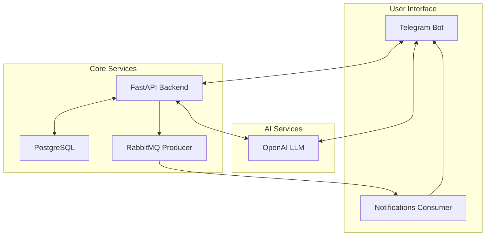

# LangFlow Platform 🎓

A comprehensive AI-powered educational platform that facilitates personalized learning through an intelligent English teacher bot, powered by GPT and modern architecture.

## Overview 🌟

LangFlow is an innovative platform designed to create personalized learning experiences by combining:

- AI-powered teacher interactions 🤖
- Adaptive homework assignments 📚
- Smart feedback generation 📝
- Real-time student progress analysis 📊

### Key Features

#### 1. AI Teacher Bot
- Natural language conversations with students
- Personalized teaching approach
- Dynamic difficulty adjustment
- Real-time feedback and corrections

#### 2. Smart Assignment System
- Auto-generated homework based on student level
- Consideration of student workload and stress
- Customized content generation
- Progress-based task adaptation

#### 3. Intelligent Feedback
- Detailed, constructive feedback generation
- Score assessment with explanations
- Personalized improvement suggestions
- Pattern recognition in student mistakes

#### 4. Analytics & Progress Tracking
- Comprehensive learning analytics
- Progress visualization
- Skill development tracking
- Personalized study recommendations

## Architecture 🏗

The platform utilizes a modern, scalable architecture:



### Components

1. **API Layer (FastAPI)**
   - RESTful endpoints
   - Request validation
   - Business logic handling
   - Authentication & authorization

2. **Database (PostgreSQL)**
   - User profiles
   - Learning materials
   - Progress tracking
   - Analytics data

3. **Message Queue (RabbitMQ)**
   - Asynchronous notifications
   - Task processing
   - Event handling

4. **AI Integration**
   - GPT model integration
   - Natural language processing
   - Content generation
   - Feedback analysis

## Implementation Details 🛠

### 1. Core Components

```python
class AITeacher:
    def __init__(self, api_key: str, client: AsyncRetryingClient):
        self.client = OpenAI(api_key=api_key)
        self.api_client = client
        self.tools = [
            # Teaching tools configuration
            {
                "type": "function",
                "function": {
                    "name": "assign_homework",
                    "description": "Create a new homework assignment",
                    "parameters": {...}
                }
            },
            # Other tools...
        ]
```

### 2. Memory Management

```python
@dataclass
class MemoryBuffer:
    recent_context: List[Dict] = field(default_factory=list)
    user_profile: str = ""
    seen_info_buffer: Dict[str, Dict] = field(default_factory=dict)
    max_context_messages: int = 100
```

### 3. Event Handling

```python
class Message:
    def __init__(self, type: MessageType, recipient_id: str, data: Dict[str, Any]):
        self.type = type
        self.recipient_id = recipient_id
        self.data = data
```

## Getting Started 🚀

### Prerequisites

- Python 3.10+
- PostgreSQL
- RabbitMQ
- OpenAI API key

### Installation

1. Clone the repository:
```bash
git clone https://github.com/yourusername/langflow-platform.git
cd langflow-platform
```

2. Set up the environment:
```bash
python -m venv venv
source venv/bin/activate  # or `venv\Scripts\activate` on Windows
pip install -r requirements.txt
```

3. Configure environment variables:
```bash
cp .env.template .env
# Edit .env with your configurations
```

4. Start services:
```bash
docker-compose up -d
```

## API Documentation 📚

The API documentation is available at `/docs` when running the server:

- User Management
- Homework Assignment
- Submission Handling
- Feedback Generation
- Analytics

## Development 👨‍💻

### Project Structure

```
langflow-platform/
├── app/
│   ├── api/          # API endpoints
│   ├── bot/          # Telegram bot
│   ├── core/         # Core functionality
│   ├── db/           # Database models
│   ├── queue/        # Message queue
│   └── schemas/      # Data schemas
├── tests/            # Test suite
├── docker/           # Docker configurations
└── alembic/          # Database migrations
```

### Running Tests

```bash
pytest tests/ -v
```

## Monitoring & Metrics 📊

The platform includes comprehensive monitoring:

- Prometheus metrics
- Request tracking
- Performance monitoring
- Error logging
